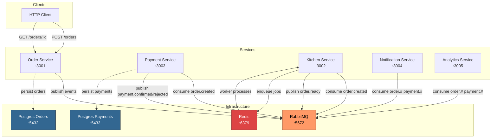
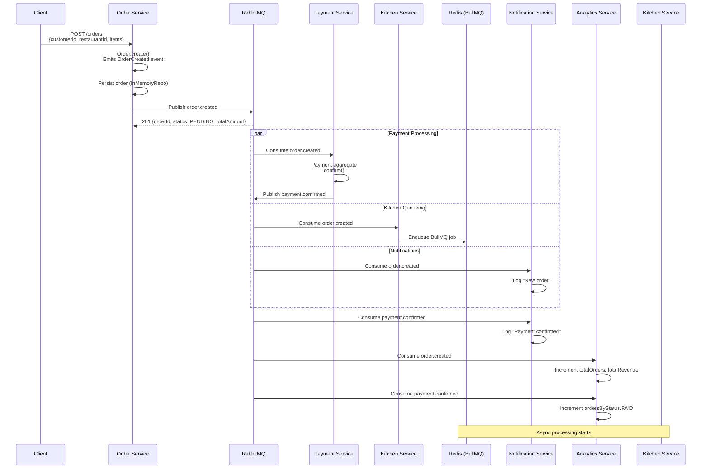
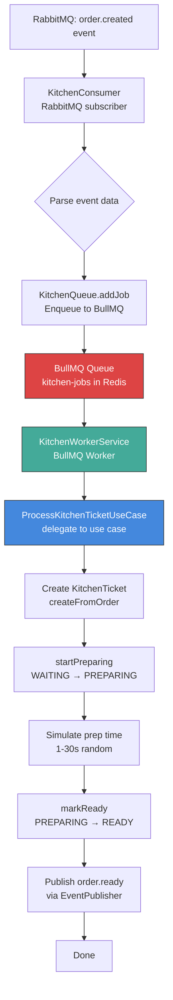
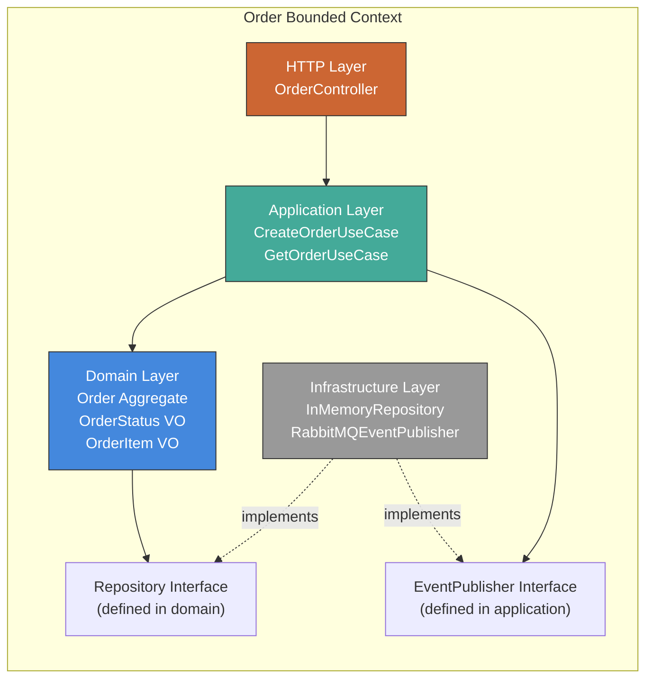
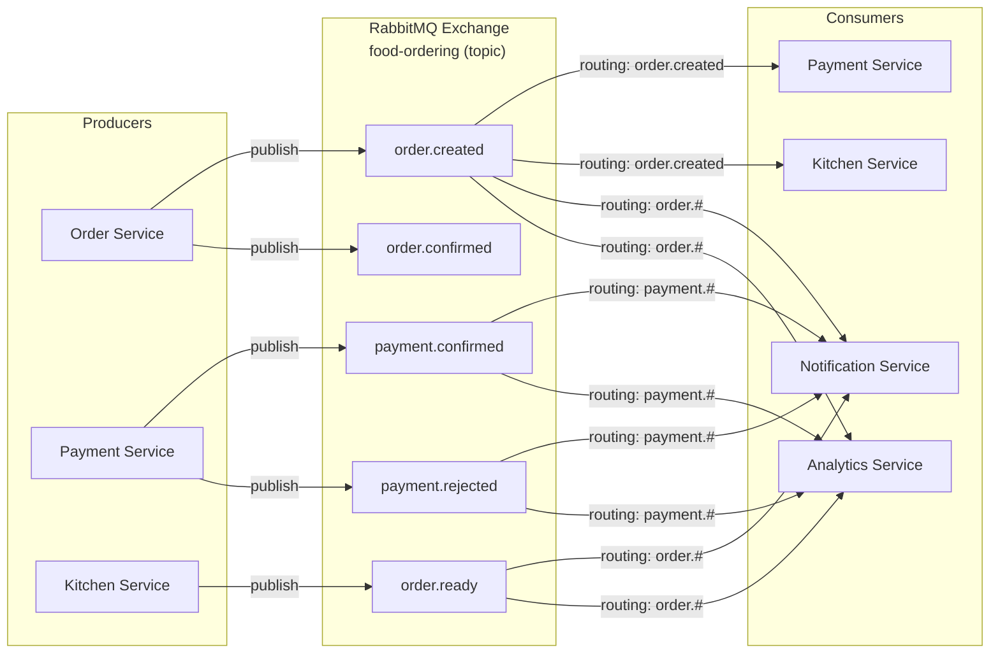
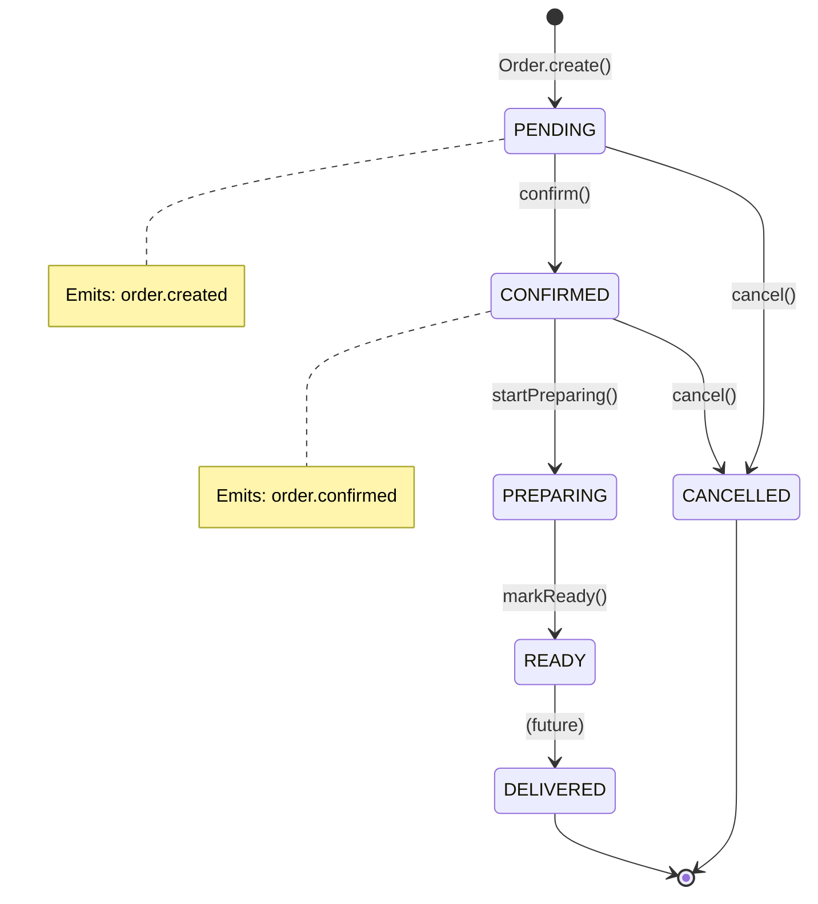
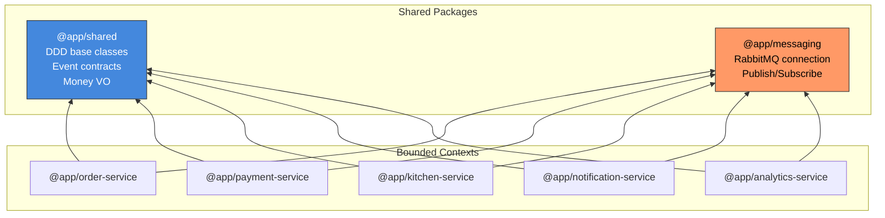

# Architecture & Flow Diagrams

Mermaid diagrams for the Food Ordering system.

---

## 1. System Architecture

Shows all services, infrastructure, and communication paths.

---

## 2. Order Creation Flow

The main flow when a customer places an order.

---

## 3. Kitchen Processing Flow (BullMQ)

How kitchen-service processes orders through the BullMQ worker pipeline.

---

## 4. DDD Layered Architecture (per Bounded Context)

Shows the dependency direction within each service.

**Dependency rule:** Arrows point inward. Domain never imports from any other layer.

---

## 5. Domain Events & Routing

Shows all events and which services produce/consume them via RabbitMQ topic exchange.

---

## 6. Order Aggregate State Machine

Valid state transitions for the Order aggregate.

---

## 7. Monorepo Structure

How the packages are organized and depend on each other.

**Rule:** Services never import from other services. Communication only via RabbitMQ events.
